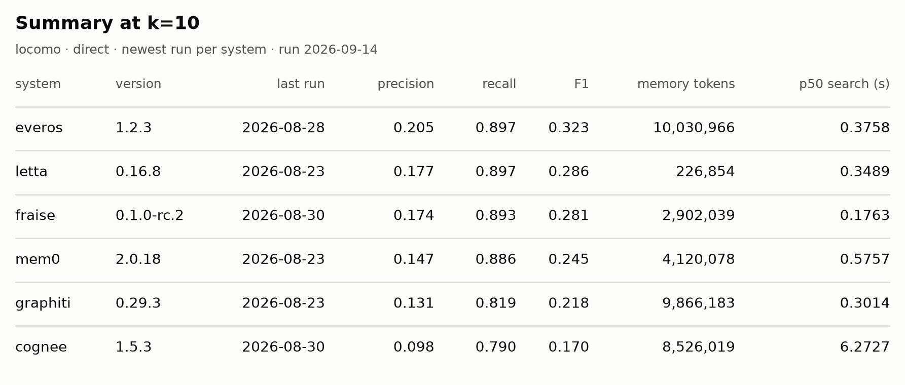
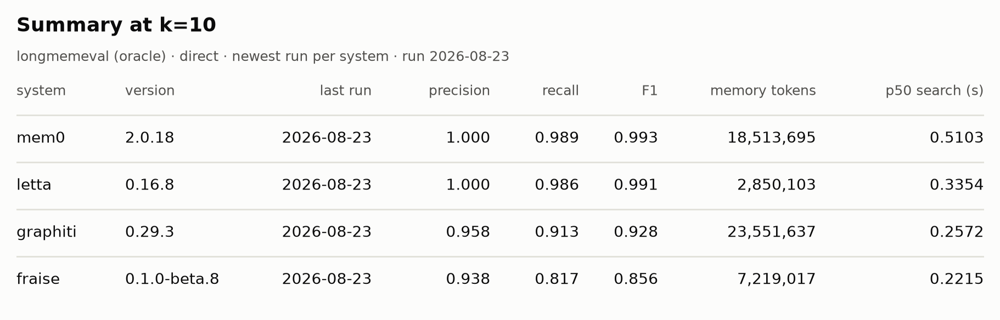

# Agent Memory Benchmark

<div align="center">

[](https://github.com/RonsenbergVI/agent-memory-benchmarks/actions/workflows/ci.yml)
[](https://github.com/RonsenbergVI/agent-memory-benchmarks/releases)
[](LICENSE)
[](pyproject.toml)

[](https://github.com/RonsenbergVI/agent-memory-benchmarks/actions/workflows/fraise.yml)
[](https://github.com/RonsenbergVI/agent-memory-benchmarks/actions/workflows/graphiti.yml)
[](https://github.com/RonsenbergVI/agent-memory-benchmarks/actions/workflows/letta.yml)
[](https://github.com/RonsenbergVI/agent-memory-benchmarks/actions/workflows/mem0.yml)

**[Results](#results) · [Quickstart](#quickstart) · [Why this exists](#why-this-exists) · [Methodology](#methodology) · [Projects in scope](#projects-in-scope) · [Contributing](#contributing)**

</div>

An open benchmark and reference for evaluating AI agent memory systems

## Results

Every image below is generated by the release CI into [plots/](plots/) — a guarded directory that pull requests cannot touch — and regenerates on every benchmark run, each figure carrying its own run date. Exact numbers, every metric, and the full k-sweep live in [RESULTS.md](RESULTS.md), guarded the same way.

### locomo

<picture>
  <source media="(prefers-color-scheme: dark)" srcset="plots/locomo/summary_k10_dark.png">
  
</picture>

<picture>
  <source media="(prefers-color-scheme: dark)" srcset="plots/locomo/k_f1_dark.png">
  
</picture>

<picture>
  <source media="(prefers-color-scheme: dark)" srcset="plots/locomo/k_recall_dark.png">
  
</picture>

<picture>
  <source media="(prefers-color-scheme: dark)" srcset="plots/locomo/k_precision_dark.png">
  
</picture>

### longmemeval (oracle)

<picture>
  <source media="(prefers-color-scheme: dark)" srcset="plots/longmemeval/oracle/summary_k10_dark.png">
  
</picture>

<picture>
  <source media="(prefers-color-scheme: dark)" srcset="plots/longmemeval/oracle/k_recall_dark.png">
  
</picture>

## Quickstart

```bash
uv sync
uv run amb datasets list            # locomo | longmemeval (+ variants)
uv run amb datasets pull locomo     # download into .data/
uv run amb run --system naive --dataset locomo            # direct mode, no LLM needed
uv run amb run --system naive --dataset locomo \
  --model openai:gpt-5-mini --judge                       # + answer generation & grading
uv run amb report                   # markdown table across all runs
```

The `naive` baseline is BM25 only — no API key, no Docker, finishes in minutes. It is the fastest way to see the whole pipeline run end to end.

## What this is

A neutral, reproducible benchmark for systematically evaluating AI agent memory systems. The repo provides:

- A curated registry of agent memory projects with links, descriptions, and metadata
- Standardized evaluation tasks across long-term recall, temporal reasoning, multi-session continuity, and contradiction handling
- A test harness that runs the same tasks against different memory systems
- Published results with reproducibility instructions
- An open methodology — contributions welcome for new projects, new tasks, and new metrics

This is not a marketing tool for any one system.

## Why this exists

The AI agent memory space has grown to dozens of distinct projects in the last two years, each making different design choices: vector-based, graph-based, hierarchical, hybrid, summary-based. The trade-offs between them are real and consequential — but there's no neutral place where they're made visible.

Today, evaluation in this space typically takes one of three shapes:

- Vendor-led: Each project's docs benchmark it against carefully-selected baselines designed to make it look favorable.
- Paper-led: Academic benchmarks use specific datasets that don't always translate to production agent behavior.
- Ad-hoc: Users informally compare two or three systems on their own use cases, with no shared methodology.

None of these give a builder a reliable answer to "which agent memory system fits my use case?" — let alone "by how much." This benchmark exists to fix that gap. The goal isn't to pick a winner. It's to make the relevant trade-offs (accuracy vs. latency, recall vs. precision, setup complexity vs. memory footprint) measurable and transparent so practitioners can make informed choices.

## Inclusion criteria

Projects must be permissively licensed (MIT, Apache 2.0, BSD) or use a credible open-source-adjacent license. Hosted SaaS without an OSS counterpart is out of scope. Open-core projects are included via their OSS edition only — commercial/cloud features aren't benchmarked.

## Dataset tiers

**Every system runs LoCoMo. Whether it also runs LongMemEval depends on how fast it ingested LoCoMo.**

LoCoMo does double duty: it is the entry test and the runtime screen in one pass. A system that cannot complete it end to end is not benchmarked at all, and there is no separate qualifying step to negotiate over. A system that completes it is then measured on ingestion cost per session, and that number decides whether it moves on.

The threshold is derived rather than chosen. LongMemEval's oracle variant is 948 sessions against a six-hour ceiling per run, so ingestion above roughly 40 seconds per session cannot finish, and a run that cannot finish spends the full budget and publishes nothing. Systems under that mark get the deep tier; systems over it stay on LoCoMo, with their measured per-session cost published alongside the result so the reason is visible rather than editorial.

Two properties make this fair rather than punitive. **The gate is re-evaluated on every full rerun, never decided once** — a new release or a corrected configuration moves a system between tiers in the next cycle, so the rule is a target to clear rather than a wall. And because runs execute concurrently, a batch takes as long as the slowest system in it; capping per-session cost bounds the thing that actually constrains the benchmark instead of proxying for it.

The full rationale, and the per-session figures each verdict rests on, are in [METHODOLOGY.md](METHODOLOGY.md).

## Status

Pre-alpha. Methodology is being defined and the test harness is in development. First results land here on the first tagged release and regenerate on every one after (see [RESULTS.md](RESULTS.md) for the full detail). Expected timeline:

- Methodology v0.1 finalized: TBD
- Test harness v0.1 (first 3 systems running end-to-end): TBD
- First public results report: TBD

## Projects in scope

### Benchmarked

| System | Repository | License | Memory model | Results |
| --- | --- | --- | --- | --- |
| Mem0 | [mem0ai/mem0](https://github.com/mem0ai/mem0) | Apache-2.0 | Vector + extraction | [RESULTS.md](RESULTS.md) |
| Letta | [letta-ai/letta](https://github.com/letta-ai/letta) | Apache-2.0 | Hierarchical (OS-style) | [RESULTS.md](RESULTS.md) |
| Graphiti | [getzep/graphiti](https://github.com/getzep/graphiti) | Apache-2.0 | Temporal knowledge graph | [RESULTS.md](RESULTS.md) |
| Fraise | [RonsenbergVI/fraise](https://github.com/RonsenbergVI/fraise) | MIT | Temporal knowledge graph + vector / text hybrid search | [RESULTS.md](RESULTS.md) |
| Hindsight | [vectorize-io/hindsight](https://github.com/vectorize-io/hindsight) | MIT | Memory units + hybrid search | [RESULTS.md](RESULTS.md) |

### Candidates

Each candidate is vetted against the [inclusion criteria](#inclusion-criteria) in its proposal issue; verdicts and integration progress land there.

| Project | Repository | Proposal |
| --- | --- | --- |
| ReMe | [modelscope/ReMe](https://github.com/modelscope/ReMe) | [#72](https://github.com/RonsenbergVI/agent-memory-benchmarks/issues/72) |
| Redis Agent Memory Server | [redis/agent-memory-server](https://github.com/redis/agent-memory-server) | [#73](https://github.com/RonsenbergVI/agent-memory-benchmarks/issues/73) |
| EverOS (EverMind) | [EverMind-AI/EverOS](https://github.com/EverMind-AI/EverOS) | [#75](https://github.com/RonsenbergVI/agent-memory-benchmarks/issues/75) |
| LangMem | [langchain-ai/langmem](https://github.com/langchain-ai/langmem) | [#76](https://github.com/RonsenbergVI/agent-memory-benchmarks/issues/76) |
| MemOS | [MemTensor/MemOS](https://github.com/MemTensor/MemOS) | [#77](https://github.com/RonsenbergVI/agent-memory-benchmarks/issues/77) |
| Memobase | [memodb-io/memobase](https://github.com/memodb-io/memobase) | [#78](https://github.com/RonsenbergVI/agent-memory-benchmarks/issues/78) |
| cognee | [topoteretes/cognee](https://github.com/topoteretes/cognee) | [#79](https://github.com/RonsenbergVI/agent-memory-benchmarks/issues/79) |
| memary | [kingjulio8238/Memary](https://github.com/kingjulio8238/Memary) | [#80](https://github.com/RonsenbergVI/agent-memory-benchmarks/issues/80) |
| supermemory | [supermemoryai/supermemory](https://github.com/supermemoryai/supermemory) | [#81](https://github.com/RonsenbergVI/agent-memory-benchmarks/issues/81) |
| MemPalace | [MemPalace/mempalace](https://github.com/MemPalace/mempalace) | [#82](https://github.com/RonsenbergVI/agent-memory-benchmarks/issues/82) |
| agentmemory | [rohitg00/agentmemory](https://github.com/rohitg00/agentmemory) | [#83](https://github.com/RonsenbergVI/agent-memory-benchmarks/issues/83) |

## Methodology

The full methodology — design principles, evaluation axes, harness design, datasets, model selection, run scoping, and cost — lives in [METHODOLOGY.md](METHODOLOGY.md).

## Running locally and in Docker

Every benchmark is the same `amb` command, with or without Docker. Locally, install the integration's package and point it at a database you run yourself (adapters read connection settings from env vars with localhost defaults):

```bash
uv run --package graphiti amb run --system graphiti --dataset locomo
```

Or let the integration's Docker environment provide the database — the container's entrypoint is `uv run amb`, so everything after `benchmark` is the identical CLI:

```bash
docker compose -f benchmarks/graphiti/docker-compose.yaml run --build --rm benchmark \
  run --system graphiti --dataset locomo
```

## Examples

```bash
# smoke run: naive baseline, 2 LoCoMo conversations, retrieval scoring only
# (BM25 only, no LLM calls — finishes in seconds; use this to check plumbing)
uv run amb run --system naive --dataset locomo --limit 2 --questions 30

# agentic run: the model drives ingestion and search through the system's
# own tools; --model is mandatory — an agentic run never falls back
uv run amb run --system naive --dataset locomo --mode agentic \
  --model openai:gpt-5-mini

# mem0 in docker, smoke test: 2 sessions of one conversation, 3 questions
# (needs OPENAI_API_KEY for mem0's extraction; compose reads the repo-root .env)
docker compose -f benchmarks/mem0/docker-compose.yaml run --build --rm benchmark \
  run --system mem0 --dataset locomo --limit 1 --turns 40 --questions 3

# trade-off plot: one dot per system, any metric on each axis
uv run amb plot scatter --x search_latency.p50_s --y retrieval_recall --dataset locomo

# draw every chart the generated reports link, into plots/<dataset>[/<variant>]
# (the release CI runs this twice per tag: light, then --dark for the
# theme-aware images the README embeds)
uv run amb plot all

# regenerate RESULTS.md (written whole); the release CI runs this on every
# tag — README is hand-written and embeds the generated images by path
uv run amb report --latest --output RESULTS.md --tag v0.1.0
```

## Contributing

See [CONTRIBUTING.md](./CONTRIBUTING.md) for the contribution process. Roughly:

- Bug reports and improvements to existing benchmarks: open an issue.
- New adapters for systems already in scope: open a PR adding `benchmarks/<system>/`.
- New systems to add: open an issue first to discuss inclusion criteria.
- Methodology critique or improvements: open a discussion in [GitHub Issues](https://github.com/RonsenbergVI/agent-memory-benchmarks/issues). This benchmark only works if the methodology is trusted. We take methodology critique seriously and document responses to substantive criticism publicly.

## Support this benchmark

Running this costs real money: every official number comes from a CI run on
tagged code, and the API spend is accounted per-run in each `summary.json`.

If the results are useful to you or your team, you can fund the run pool
through [GitHub Sponsors](https://github.com/sponsors/RonsenbergVI). API
credits count and are disclosed exactly like cash.

**Sponsorship buys nothing about results.** No influence on methodology,
configuration, datasets, run timing, presentation, or which systems are
included — and there is no human step in the pipeline where influence could
apply. The full policy, written before any sponsor existed, is in
[SPONSORS.md](./SPONSORS.md).

## Citing

If you find this work useful, please use the citation:

```bibtex
@software{corneille2026agentmemorybenchmarks,
  author  = {Corneille, Ren{\'e}-Jean},
  title   = {agent-memory-benchmarks: an open benchmark for {AI} agent
             memory systems},
  year    = {2026},
  url     = {https://github.com/RonsenbergVI/agent-memory-benchmarks},
  version = {0.0.1},
  note    = {Results generated by CI from tagged code; all run artifacts public}
}
```
